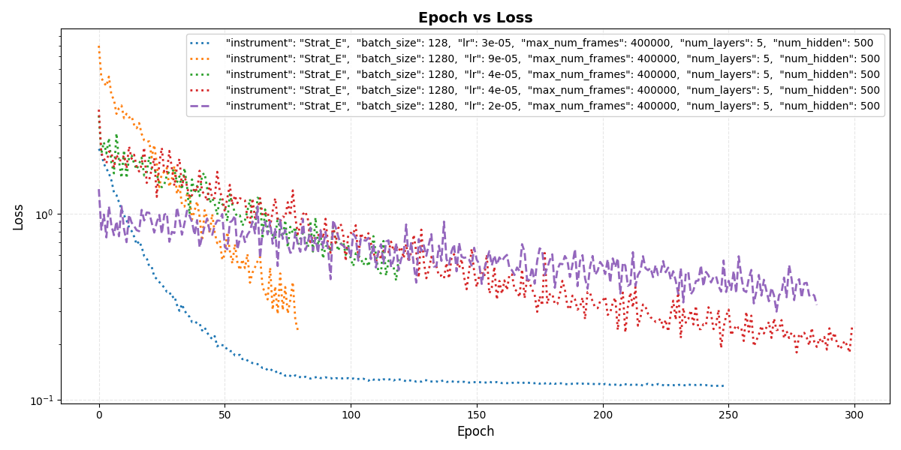

# Progress
## Initial setup
### Network, feedback and features
The basic idea was to approximate a real string with a refined Karplus-Strong-Algorithm, where the loop filter is 
replaced by a neural network. The first training data comes from a DI recording of the low E-string of my Stratocaster
guitar. The neural network is a 2x64 hidden layer tanh with a single output (next sample prediction) and a few integer
delays of the output. Since the main task of the resonator system should be: LP Filter the signal and delay it by the 
period duration, the first shot at the input features were the following delay structure:
- y_1, y_2, y_3 => To let the system design a kind of IIR Filter for the faster decay of high frequencies
- y_T+3,y_T+2,y_T+1, y_T, ...y_T-3 => To let the system swing in the correct frequency, find proper coefficients for 
the interpolation between samples and so on

Control Inputs were only present in the form of constant dummy data.

### Training data
The training data were taken from a "decay only" version of the original string sample. At first, I only took about 
5 sec from the start, leaving out no sample. 

### Loss function
I started with a simple MSE. 

### Training process
The training process is performed sample wise in batches. Due to a misunderstanding of the exact meaning of batch_size, 
I started off with a batch size of 20000, quickly reducing it to more practical values.

### Inference/sound generation
The resonator as such does not produce sound of its own without being initialized. For the time being, 
without yet having extracted exciter signals and functionality, we just initialize the delay buffers with the first 
samples of the original sound file.  

## First results
The very first result file was a bit misleading, because it only seemed to have a small issue that might be easy to fix:
It was a decaying string that stopped decaying at some point and rang on forever. My interpretation was as follows: 
The network is non-linear. So small signals can have a different decay than big ones. So far, so good. Big signals are 
apparently more accurately represented than small ones, and the small ones have a bigger amplification due to the 
tanh-function.
### First measures
Since big signals are more accurately represented, the loss function must be made relative. So I changed that to 
relative_l1. That didn't fix it, but nevertheless seemed a good idea, because the decay of the string is also relative.

The second thought was that more linearity is needed, so I tried to take out the tanh layers step by step, with 
different but no better results. 

In an attempt to gain some more knowledge about what was going on, I tried to throw more hidden neurons and thus 
processing power at the network, giving it more possibilities to reflect a broader range of linearity. Still no success. 

### More sophisticated thoughts
So there were quite a few measures taken, with no real improvement, although they all seemed to make sense in some way. 
Let's dive deeper into what went wrong. 

#### The different behaviors
How did the system behave exactly in the failed experiments. I could not only observe different types behaviors 
throughout the simulated string decay, but also find out, that the behavior does not fully depend on the systems parameters,
but is also quite random. So, I think the randomness introduced in training let the system show different behavior, but 
in the end, each model had all problems at once. Let me list the behaviors:
- Not decaying at some point (as described for the first result)
- Decaying, but decaying much too fast
- finally converging to a biased value, not 0

#### Questioning my mental model
My mental model was that a decaying string should be able to be modeled through a filtered feedback delay. 
In my imagination a good approximation would be to just take the appropriate delayed signal (some of the inputs or 
a mix of some sorts) and the results should be better than what I actually got. The nonlinearity of the hidden neurons
couldn't be the only culprit, since even removing them, the network didn't learn to approximate as imagined above. 
So, what was it that made it so difficult for the system to learn appropriate behavior?
The following ideas came to my mind: 
- We were trying to learn sample accurately from one sample to another. Tiny errors will have huge impacts due to the 
feedback nature of the system.
- Are the training samples of my real world strat really that clearly stating: Decay a tiny bit in every loop?
- Are the training data evenly spread across the WHOLE dynamic spectrum?
- Are they even symmetric?

#### ...and deriving measures
Armed with these questions a whole lot of more sophisticated measures can be taken:
- When we want the system to show a more statistically correct overall behavior, we must stop training it only 
sample-wise. Errors will show after 2,3,4...10 iterations much more clearly and more importantly: relevant for the 
outcome than just predicting the next sample. => Find a way to make training based on more long-term predictions, 
so the network gets the chance to learn the behavior more globally/statistically than per sample.     
- When having a look at the real world training data, I actually found out: No, the data do not state a clear decay 
per sample (even per loop/period). I guess it must have something to do with noise and/or the fact that a Strat's 
pickup transmits the energy depending on the plane it vibrates in. Since the plane can change, there is no 1:1 relationship 
between the energy in the string and the signal and the signal we see might get louder for a small while. To prevent this
I resumed to a Karplus string generated training signal for the time being. Also, different real recordings could be 
used to show a better sense for the statistical behavior. 
- Make the training use the whole input file until it is decayed. Not only 5 s.
- Force the training data to be symmetric by always adding a negated version of the samples.

## Further Progress and results
### Using Karplus Strong training sample
- Not the expected result at first
- Omitting nonlinear Hidden Layers, the general decay and LP behavior could be simulated, which was a giant step, 
regarding the poor first results. But there was a bias aggregating, so I assumed the model needs a protection 
against bias. Since there was no bias inherent in the model, I started focusing on the training data. 
### Using symmetric input
- When forcing every training sample to contain its negative version (in terms of audio inputs), the model soon learned
to decay around the center line. Only just at the end of the result files, we are able to notice a small DC component. 
- I assume that at very small signal levels, training data is getting very scarce, so we need to address that.
### Using a broader range of training samples

So far the training samples consist of the first N samples of one decaying sample note, both in original and negated 
version.
Although it looks like many samples containing all the necessary information about the behavior of the original string, 
we have a systematic lack of information:
- We only have one training sample per phase and energy level. Noise might disturb the network.
- We cut the signal at some point to save training time, so no small-signal tail is present in training data.

Ideas:
- Using more different input files with different versions of the same tone will provide a more general idea
- Integrating smaller signals into the training data, randomly leaving out bigger ones to not further bloat the training
time

Results: 
Simply integrating these ideas did not have the desired impact yet. We need to look further into the details of the
training process.

### Thoughts about generalisation
When thinking about the training data, and the systems inability to handle small signals without generating biases, 
some thoughts came to my mind that didn't have to do too much with training data quality: It was the systems (in)ability to
generalize. At first, I had a very good approximation of a vibrating string in mind: Karplus-Strong - Delay, Decay, Filter.
This is a generalisation, that the system could have learned to solve the task with very little effort. But it didn't
and instead, in my eyes, performed much worse. 

Why? I guess for multiple reasons:
- I didn't really tell it, what mattered to me most (statistically correct decay), and taught it to be sample correct 
instead
- It might be a case of overfitting: While I want it to generalize and learn a smooth filter and decay in the first place,
the network tries to learn every detailed behavior at every dynamic stage, which it might even be capable of, considering
its amount of hidden layers. 

Considering the overfitting, the easiest solutions to try first are:

- (Already mentioned) Increasing the amount of training data files to enhance the variety of training samples
- Reducing the network complexity (until we want to improve realism and find our network is over-generalizing)
- More input features (adding delay lines like 1/4T ) would provide much broader input. E.g. before, without 1/4, input 
values near zero might be a zero cross or just a small value. Providing a 1/4T delay, the training samples will show a 
much bigger difference and thus provide valuable info to the model so that it can deduct meaning better instead of 
clamping to mere numbers and exact samples.     

If that doesn't work, other techniques generally recommended against overfitting can be tried, but we would first need to
find out about the specific nature of the system's behavior and decide then what makes most sense.

### Thoughts about physical knowledge
While the idea about statistically correct decay is not yet implemented, because it is quite some big change in the 
implementation, I integrated another way to force knowledge about the physical system into the artificial one:  
Do not put more energy into the output than the training data admit. Allowing energy increase can have a fatal effect
in a fed back system that is supposed to decay: One signal input constellation that actually amplifies the signal can 
lead to an infinite loop in the output signal. Therefore (illegally) amplifying the signal must be punished harder in 
the loss function. I concluded to update my loss function to "relative_l1_with_penalty".

We didn't yet think about an important point  and that might heavily disturb both our mental and DeepLearning model
is that the signal of electric guitar such as the recorded model does not represent exactly the movement of the strings
and its energy. While it is impossible that the string gains energy during the decay process,
the signal that comes out of the pickups can in deed! This is possible because the signal that comes out of the guitar's
pickup depends also on the plane in which the string moves, not only the movement energy. This plane can rotate and cause 
sort of a tremolo effect.  
The big problem with using this signal as training data: The network learns that it is ok to amplify the input under 
certain conditions. But the real reason why this "amplification" is physically legal can barely be deduced by the network, 
because until now, we simply do not provide it with the data about the string's vibrational plane. A solution might be to
introduce another (or multiple) input variable(s): "Current energy", "Current visible energy" or, less physical, 
"current decay (relative to the average decay)" and "accumulated relative decay"
From this information, the system can deduct: 
- "Ok, this output sample must be (or this TRAINING sample IS ) higher, because we currently decay a bit slower than usual." 
- But also "Ok, we have decayed slower than average for quite some time now, lets start decaying faster, so we meet the 
physical requirements/do not get stuck"

### First successful reproduction of KS Signals
While the reproduction of the real world Strat guitar has not had a satisfactory outcome yet, I was able to reproduce
a correct (judged by ear so far) signal of the synthetic Karplus-Strong generated decay behavior.

See sound examples
[output1](./../data/results/resonator/documentation/first_success_with_KS/output_1.wav)
[output2](./../data/results/resonator/documentation/first_success_with_KS/output_2.wav)
[output3](./../data/results/resonator/documentation/first_success_with_KS/output_3.wav)

and comapre them with
[training1](./../data/processed/decay_only/KS_Short_E/0/1.wav)
[training2](./../data/processed/decay_only/KS_Short_E/0/2.wav)
[training3](./../data/processed/decay_only/KS_Short_E/0/3.wav)

Note that not the whole file necessarily has been part of the training and apart from initialization with the first 
samples of the training file, the output has been generated completely via running the fed back system. 

### Preliminary Conclusions
While we were able to reproduce the simple synthetic resonator, we are still quite far away from reproducing a 
complex real world system. Many ideas have been implemented, yet in that domain, we still suffer from some main symptoms:
- The output decays very fast, settling on a non-zero value (especially fast decay with a high penalty on higher energy output)
- The output will not come to rest and ring forever (with a lower penalty on higher energy output)
- Loss numbers seem to stagnate

While there are still some ideas unimplemented (calculate loss only after a few generations of feedback +
deriving "(invisible) energy"/"(accumulated) decay" features), I have the feeling that before further going down that 
road and - albeit rational - trying out a bit blindly, I should organize configuration and documentation/monitoring 
of the process in a more comfortable way. Trying out new parameter combinations and documenting them had become very 
uncomfortable and my overview over which parameters caused which behaviour and how much potential is in the model as is, 
without any further introduction of features, physical knowledge and the likes, was suffering. So, for the time being, 
it was time to reconsider the current architecture and lay the bedrock for a system that can be analyzed and configured 
more easily and efficiently. 

## Refactorings
### Result folders and parameter documentation
#### First approach and its flaws

I started with a kind of "versioning" approach, meaning that a parameter set was assigned a version string and the 
mapping of version string to actual parameters was made in the actual source code. That way I had hoped to clearly 
document the evolution of my training and model parameters. But I learned that my process at this point of my deep 
learning journey is way too much trial and error that I did not want every parameter change to get a new version string
or get lost under a "dev" version umbrella. Also, deciding which parameter set should get a new version string is a
process that costs mental resources that can be used better for finding the technical flaws of the model, skillful feature
extraction and the best training approach and parameters.

Also, a better documentation method of the resulting files must be found. The first idea, putting results into subfolders
representing the versions, wasn't practical for two reasons: I wanted to get away from the version strings anyway and navigation
into the subfolders was getting time-consuming.

And, last but not least: Model files and resulting audio files were not in the same folder. That was due to trying to 
follow a standard python machine learning project structure: Models get their own folder in the project root. Since this 
project is not a standard machine/deep learning project, but a documentation of my progress, I decided to emphasize 
traceability and put every file of each run into the same folder. 

#### New result folder system
To not accidently overwrite any result rendering, I decided to automatically add a "run" folder on each model training, 
in a git-ignored subfolder. Once I consider a result relevant enough for documentation, I copy it to a version controlled
folder.

#### Parameter and training success documentation
I replaced the parameter documentation based on version-string subfolder by logfiles written to the output folder. 
Rudimentary Documentation of the training progress via simple epoch/loss was added. At the moment, the logging system is 
still a bit awkward, since it only consists of redirected prints, but I considered it a pragmatic approach for the time 
being to be able to make progress without investing too much time into a spotlessly clean architecture that slows development
down before a real success is made or MVP is reached.
 

### Flexible configuration

Getting away from the version strings, I introduced a config file which just represents the current configuration. 
It is not very sophisticated at this point: One file under version control (constantly modified). But at least, we do not 
have the burden of deciding which parameter set deserves a new version. 

### Training performance and caching

I noticed that not only the training of the network took some serious time, but also the generation of the training data, 
which seems to be due to a very slow delay line implementation (even though it's an integer-length delay without interpolation).
For the time being, I introduced a training data cache and with a cache hit, I seriously save time per training. (~120 seconds per run, 
depending on the length of the training files).
For the actual run of the model in "production" context (also for a training target that represents multiple generations
of loop feedback) I will need to drastically reduce the delay line's CPU consumption, which I guess has something to 
do with an inefficiency of np.zeroes_like at small buffer sizes. But further investigation needs to be made and accurate
tracing/profiling tools be used to really know what is the problem. 

### Project architecture

I noticed that the scripts had grown somewhat wildly which is not in line with my ethics as a senior developer, but 
**more importantly** were beginning to slow me down, because I lost overview and control as well as usability. So I decided
that before beginning the changes I mentioned above, I needed to clean up the whole structure:

- Central configuration
- Clear separation of concerns regarding domain logic and composition/adaptation
- Introduction of a composition root

Even if the resulting architecture is not perfect at the moment, I noticed a clear boost in my performance as a developer,
engineer and problem solver. Information is not scattered along the project, I mainly edit app.py. (not cool in a shared 
production project, I know, but for the time being, it works: I have one file to work with.) Dependencies are built in 
container.py.

### Monitoring tools

I am a visual person. Comparing numbers and their orders of magnitude, their statistics is nothing I can do just staring 
at the numbers themselves. I need tools to visualize them. 

At the moment, a visualization of the training loss course seemed to be the most logic, because I noticed that I could not 
remember exactly which parameters resulted in which behaviour and I can't decide if a loss jumps around without getting 
or steadily getting better on average, even though it's oscillating quite a bit. 

Setting up a quick EpochLossViewer with Matplotlib offered me a quite good overview over convergence, oscillations and
the according training parameters.

### Effects of the refactoring: Ability to explore the parameter space and boost my DL training knowledge

Armed with that freshly found flexibility in configuration, documentation and visualization, I was able to dive much deeper
into the theory of DeepLearning, see connections between parameters themselves and parameters and training behaviour. 
Most importantly I can now ask further questions concerning the whole theory of DL training without having the feeling 
that it is too abstract, because I cannot try it out immediately or because my project has got so many other unfinished 
businesses that I cannot focus on looking deeper into the meaning and effects of training parameters.

## Deep Learning Deep Dive

### Hyperparameters Exploration

Now that I have a proper environment with a traceable history of parameters and results as well as a visualization tool
set up, it is much more comfortable to dive deeper into the analysis of the system's behavior and the effect of each parameter.
A good thing in today's era of AI is that once a question arises in my mind, I can instantly ask an LLM instead of having to 
wait for the next time seeing my professor or colleague or getting an answer in an online-forum.  

#### Batch Size vs Learn Rate

The first thing question that came to my mind was about the relation between Batch Size and Learn Rate, which I guess would
have been well known to me if I had more experience in Deep Learning. I was able to reproduce the **linear scaling rule**, 
but interestingly for my progress, outside the recommended range of 126-256 as a maximum batch size, the noise between
batch losses went up. Maybe it is just the usual effect of "more batch numbers have a smoother average than less", but still
the idea of loss distribution, and the importance of difficult training samples for the overall performance of the fed 
back system came to my mind. 

#### Epoch Loss Plot interpretation

Also, the importance of the "number of performed updates per epoch", which varies with batch_size, number of training samples 
can be seen impressively in the plots. Each graph in my plot is only really comparable with the same update rate per epoch, 
or must be at least be transformed mentally to be interpreted. 

### Loss Distribution among samples and questioning my loss function

### Adjusted Loss Function for the Win

